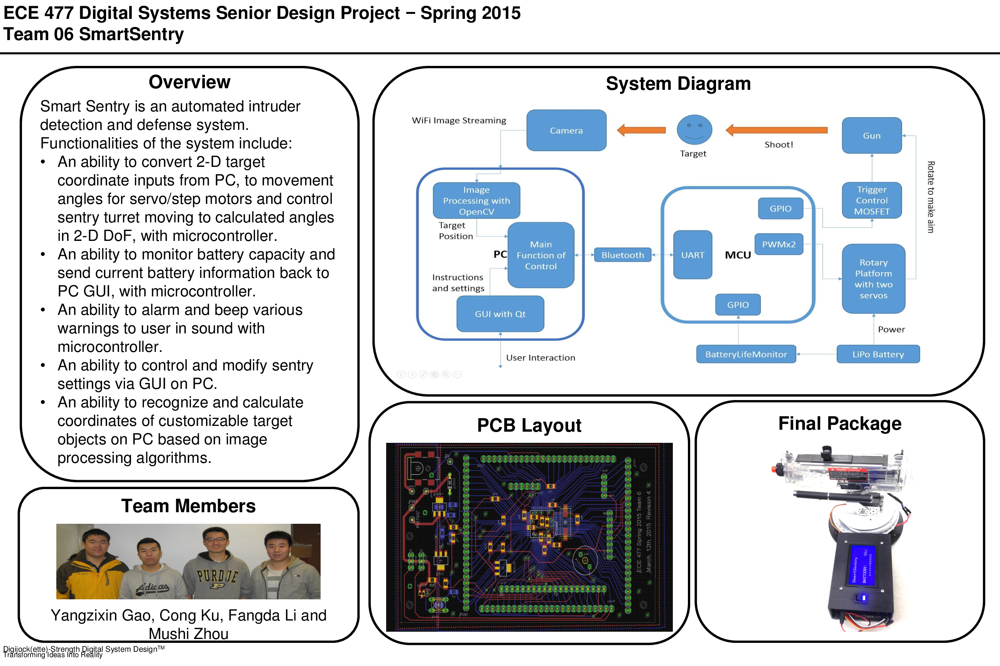

# ECE477 SmartSentry
This repo contains the relevant code for recognizing face, human and waving gesture in a video stream.
Project page can be found [here](https://engineering.purdue.edu/ece477/Archive/2015/Spring/477grp6/).

